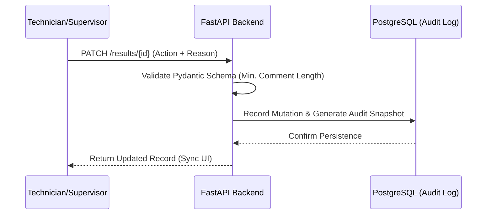

# LIMS-QC-Automation
### *Bridging the Gap Between Analytical Automation and Regulatory Accountability*


> **EDUCATIONAL USE ONLY:** This software is a proof-of-concept designed for educational and portfolio purposes. It has not been validated for clinical use as defined by CLIA '88 or ISO 15189 standards. Do not use this system for patient diagnostic decisions.

## Table of Contents
* [Executive Overview](#-executive-overview)
* [The Clinical Problem](#-the-clinical-problem)
* [System Architecture](#-system-architecture)
* [Compliance & Data Integrity](#-compliance--data-integrity-alcoa)
* [Deployment and Usage](#-deployment-and-usage)
* [Future Roadmap](#-future-roadmap)


## Executive Overview
**LIMS-QC-Automation** is a full-stack Laboratory Information Management System designed to modernize the Quality Control (QC) lifecycle. 

In many laboratories, automation is often limited to simple 2SD range checks, while detailed supervisory review remains a retrospective, often monthly, task. This project provides a real-time, audit-ready oversight layer that enforces **Westgard Multi-rule** application and **Role-Based Accountability** at the point of data entry. By shifting from passive tracking to active flagging, the system ensures that out-of-control events are handled with the clinical urgency they require.


## The Clinical Problem
While instrument automation has advanced, the management and review & release of Quality Control data often remains fragmented. This project addresses three primary operational risks:

### **1. No Lookback System**
Many small labs don't use automated lookback systems, and are limited to rigid range checks (typically mean ± 2SD). Without nuanced **Westgard Multi-rule** detection ($1_{3s}, R_{4s}, 2_{2s}$, etc.), laboratories risk unecessary rejections that waste expensive reagents or, more critically, systemic shifts that go undetected by simple standard deviation limits.


### **2. Review Latency**
In traditional workflows, the detailed justification for out-of-control events is often documented retrospectively, sometimes weeks after the event during a supervisor's monthly sign-off. This creates a dangerous blind spot where an instrument may continue running patient samples despite a significant analytical drift.

### **3. Audit Fragmentation**
Justification comments, corrective actions, and instrument maintenance logs are frequently scattered across various paper binders, instrument-specific files, or supplemental spreadsheets. This ecosystem is difficult to navigate during a CAP or CLIA inspection. **LIMS-QC-Automation** centralizes this data into an immutable, queryable PostgreSQL backend, ensuring that every result is linked to its reviewer and its rationale.


## System Architecture
This project adopts a "Docs as Code" philosophy, ensuring that the system architecture is as modular and auditable as the clinical data it handles. The stack is designed to ensure strict data validation before any mutation reaches the persistent storage layer.

### **The Technical Stack**
| Layer | Technology | Strategic Role |
| :--- | :--- | :--- |
| **Frontend** | React 18 + Vite | Reactive UI for real-time statistical visualization and responsive dashboarding. |
| **API** | FastAPI + Pydantic (Python) | High-performance asynchronous processing; handles complex clinical logic and RBAC enforcement. |
| **ORM** | SQLAlchemy 2.0 | Strict schema enforcement; manages the relational link between results and their audit trails. |
| **Persistence** | PostgreSQL | Relational storage designed for high-integrity, immutable logging of clinical actions. |

### **Data Lifecycle & Flow**
The system ensures data integrity through a "Server-as-Truth" model. By utilizing custom middleware, the backend extracts user identity from the request headers, ensuring that the audit trail is independent of the client-side state.



## Compliance & Data Integrity (ALCOA+)
To professionalize the project for the health-tech sector, the system is engineered to simulate **ALCOA+** principles: the global gold standard for clinical data integrity required by CAP, CLIA, and ISO 15189.


| Principle | Technical Implementation |
| :--- | :--- |
| **Attributable** | All actions are linked to a unique `User-ID` extracted via FastAPI dependency injection. |
| **Legible** | Structured JSON logs and human-readable Levey-Jennings visualizations. |
| **Contemporaneous** | Server-side timestamps are automatically generated at the moment of database persistence. |
| **Original** | The `AuditLog` table preserves the "Old Value" snapshot before any record mutation occurs. |
| **Accurate** | Automated $Z$-score calculations eliminate manual transposition and interpretation errors. |


## Deployment and Usage

This section details the steps required to deploy the environment and verify the system's core audit-traceable logic.

### Prerequisites
* **Docker & Docker Compose:** Recommended for maintaining environment parity across the full stack.
* **Node.js 18+ / Python 3.11+:** Required only for local development outside of the containerized environment.

### Environment Setup (Docker)
To initialize the complete ecosystem (PostgreSQL, FastAPI, and React) as a single unit:

```bash
# Clone the repository
git clone [[https://github.com/Chessgeek-svg/LIMS-QC-Automation](https://github.com/Chessgeek-svg/LIMS-QC-Automation)]
cd LIMS-QC-Automation

# Build and start the services
docker-compose up --build
```
### **The Happy Path Workflow**
To verify the system's core audit-traceable logic, follow this guided sequence.

### Phase 1: Seed the Environment (One-Time Setup)
If the database is empty, you must define a test analyte via the backend API before using the dashboard.

* **Access API Docs:** Navigate to `http://localhost:80/docs`.
* **Register an Instrument**: Before defining analytes, you must register the hardware source in the system.
    * **Access API Docs**: Navigate to `http://localhost:80/docs`.
    * **Endpoint**: Locate the `POST /api/v1/instruments/` endpoint.
    * **Execute Request**: Register an analyzer. The following is an example, the variables for all forms can be filled as the user sees fit.
    
```json
{
  "name": "Chemistry Analyzer 01",
  "model": "Cobas 6000",
  "serial_number": "SN-98765"
}
```
* **Define a Test:** Locate the `POST /api/v1/test-definitions/` endpoint.
* **Execute Request:** Click **"Try it out"** and use the following JSON payload to create a test:

```json
{
  "analyte_name": "Glucose",
  "units": "mg/dL",
  "mean": 100.0,
  "std_dev": 5.0,
  "instrument_id": 1
}
```
* **Confirm Creation**: Ensure the server returns a 201 Created status.

### Phase 2: Ingest QC Data
Once the instrument(s) and test(s) are defined, you can simulate a data stream by posting individual QC runs.

* **Endpoint**: Locate the `POST /api/v1/results/` endpoint in the Swagger UI.
* **Execute Request**: Use the following JSON to post a result that deliberately triggers a $1_{3s}$ Westgard violation (based on a Mean of 100 and SD of 5):

```json
{
  "test_definition_id": 1,
  "value": 116.0,
  "user_comment": "Routine morning QC run"
}
```

### Phase 3: The Data Review Workflow

* **Initialize Session**: Access the dashboard at http://localhost:5173.
* **Role Selection**: Use the **Role Switcher** in the top-right corner to select **"Lab Manager (Supervisor)"**.
* **Identify Violations**: Select your new test (e.g., Glucose) and locate a result flagged with a Westgard violation, such as a $1_{3s}$ or $R_{4s}$ flag.


* **Execute Audit-Traceable Review**:
    * Click **Review** on the flagged result.
    * Enter a **justification comment** (The system enforces a minimum length of 5 characters to simulate regulatory compliance).
    * Click **Verify & Pass**.
* **Verify Backend Persistence**:
    * Observe the **real-time state update** (Status changes to **VERIFIED**) in the UI.
    * Confirm the **server-side audit log generation** by checking the `AuditLog` table via the `GET /api/v1/results/{id}` endpoint in the Swagger docs.
## Future Roadmap
This project currently serves as a functional framework for clinical data tracking and audit-trail persistence. The following strategic milestones are planned to transition the system from a prototype to an enterprise-grade solution:

* Enterprise Authentication: Implementation of OAuth2/OpenID Connect (via Keycloak or Auth0) to replace header-based role simulation with production-grade identity management.
* Root Cause Recommendation Engine: Leveraging historical audit logs to build a lookup engine that suggests common corrective actions (e.g., "Reagent Lot Change" or "Probe Clean") based on similar past violations.
* Containerize Frontend: Currently, the frontend is served via a local development server (npm run dev). The next step is to implement a multi-stage Docker build to compile the React application into static assets and serve them directly via the NGINX container.

## License
Distributed under the **MIT License**. See `LICENSE` for more information. 

*Note: The MIT License provides a framework for liability but does not convey regulatory clearance for medical use.*